# Google Workspace Enforcer の使い方

こんにちは！:wave: 本ドキュメントでは、Google Workspace Enforcerの使い方を解説します。

## これはなに？

このBotは、Discordサーバーの参加者をGoogle Workspace 組織のメンバーに限定したい場合に有効です。  
例えば…

* チームでGoogle Workspaceを使っていて、コミュニケーションにDiscordを使っている
* どこぞの学校の生徒だけが入れるDiscordサーバーを運営したい

といったケースに便利です！

## 使い方

### Botを導入する

まずはBotを導入しましょう！[こちら](https://discord.com/api/oauth2/authorize?client_id=1134920666139852800&permissions=268453888&scope=bot%20applications.commands)から、あなたの管理するサーバーにBotを導入できます。  
> Note:  
> Botの導入には**サーバーの管理**権限が必要です。

### ロールを設定する

認証が完了した際にBotが自動的に付与する役職を作ります。  
便宜上、ここでは「認証済みロール」と呼びましょう。  

`/role`コマンドを使用してロールを設定します。こんな風に:  
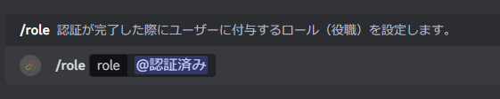

以下のようなメッセージが出れば成功です:  
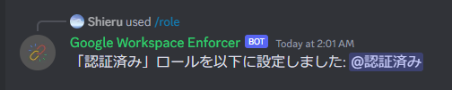

役職の順序が間違っている場合、以下のようなメッセージが出ます:  
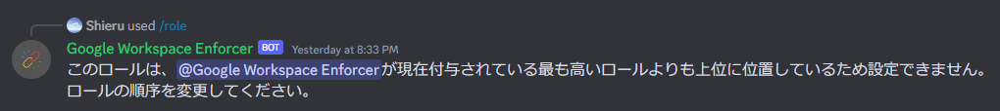
ロールの順序を変更し、Botが持つ役職よりも低い位置に認証済みロールを設置してください。

### チャンネルを設定する

認証が完了した際に、Botが通知を送信するチャンネルを作ります。  
便宜上、ここでは「ログチャンネル」と呼びましょう。

`/channel`コマンドを使用してログチャンネルを設定します。こんな風に:  
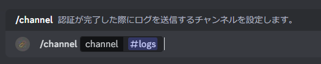

以下のようなメッセージが出れば成功です:  
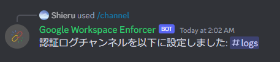

### ドメインを設定する

認証可能とするドメインを設定します。  
公開Botでは3件まで設定できます。

`/domains`コマンドを使用して、認証可能なドメインを構成します。  
`/domains add <domain>`を使用して、認証可能なドメインとして`example.com`を追加しましょう。こんな風に:  
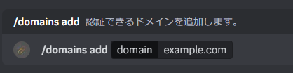

これ以上ドメインを追加できない場合、このように表示されます:  
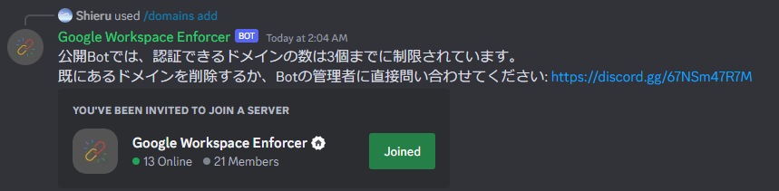

追加したドメインは、`/domains remove <domain>`で削除できます:  
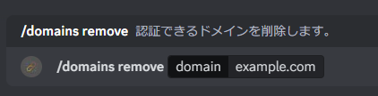

追加したドメインの一覧を見るには、`/domains list`を実行します:  
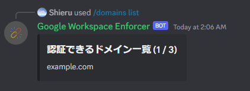

### 設定を確認する

今までの設定を確認しましょう。  
`/settings`を実行すると、Botは設定の簡易チェックを行います。

設定が間違っている場合、なぜその設定が間違っているのかが表示されます。例えば:  
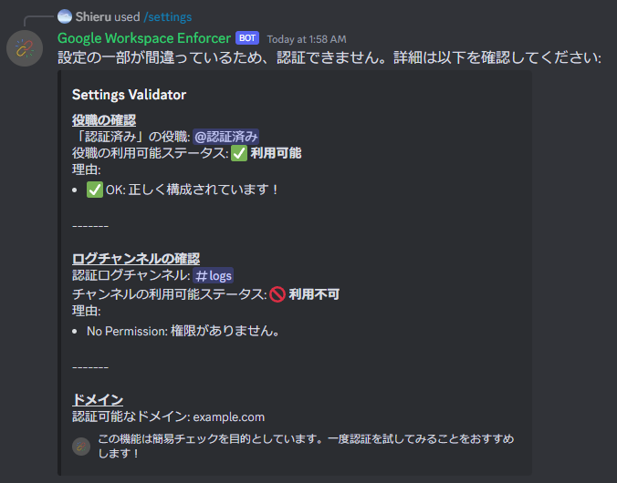

「認証は利用可能です」というメッセージであれば、設定は（おそらく）うまく構成されています:  
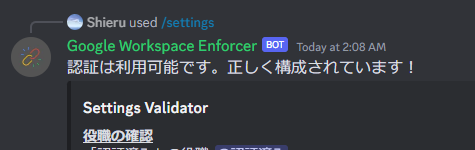

### 認証を開始する

メンバーは、`/verify`コマンドを実行して認証を開始できます。  
コマンドが実行されると、Botは認証URLを発行し、Ephemeralなメッセージで実行者に送信します。こんな風に:  
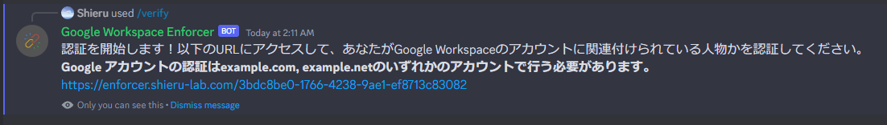

設定不備により認証が開始できない場合、Botはそれを実行者に伝えます:  
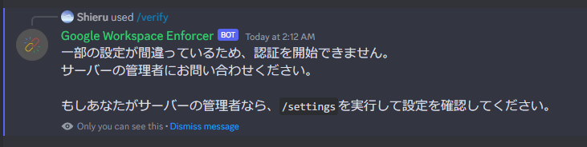

### 認証を実行する

Botが発行したURLにアクセスすると、このようなページが表示されます。  
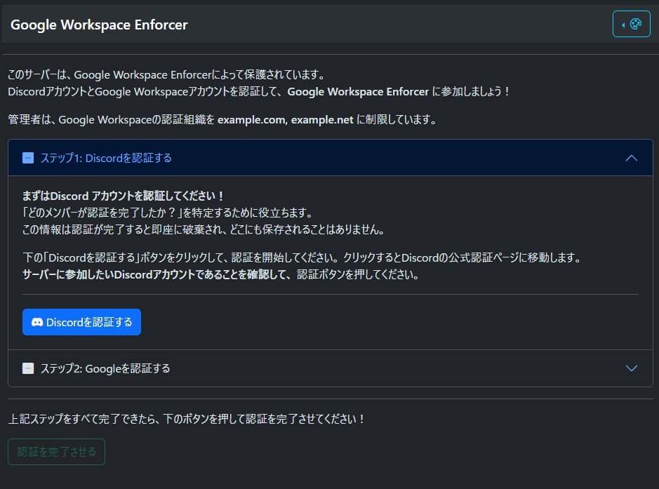

指示に従ってDiscordアカウントとGoogleアカウントをリンクすると、以下のような画面になります:  
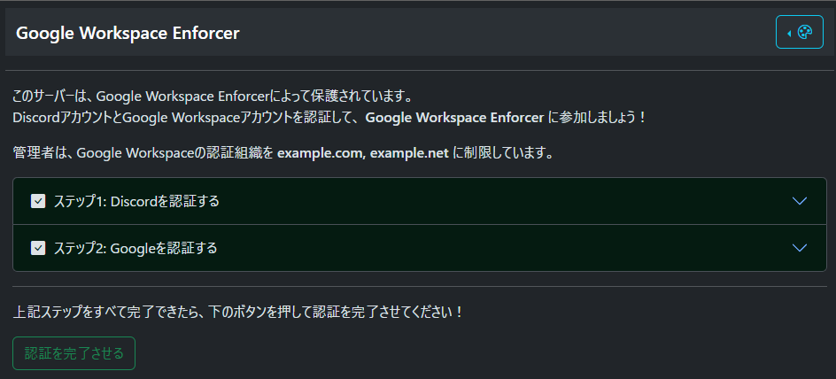

認証可能なドメインにないGoogle ワークスペースでGoogle アカウントを認証すると、  
以下のようなメッセージが表示され、再ログインを求められます。  
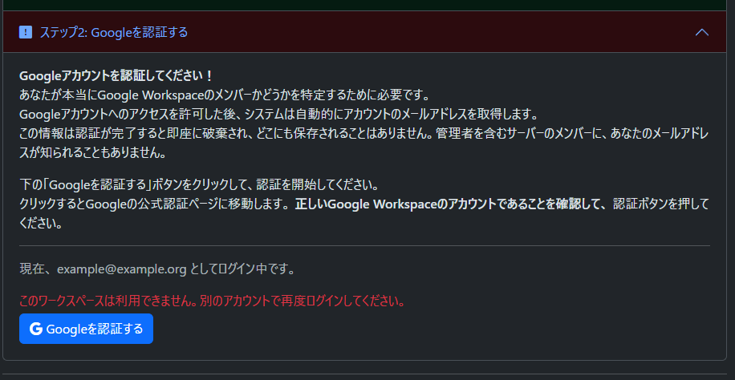

認証が完了すると、以下のようなページが表示され:  
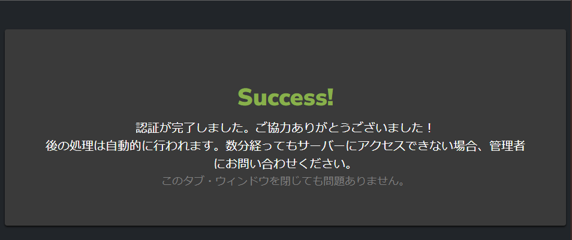  
ログチャンネルに以下のような通知が送信されます:  
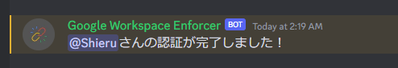  
また、自動的にロールが付与されます:  
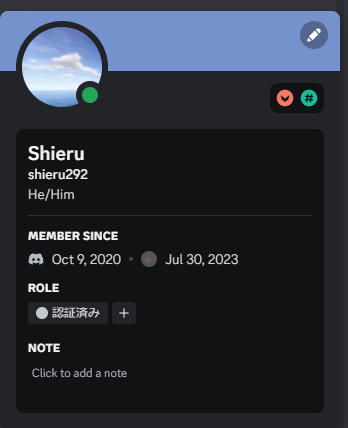

認証完了中に内部エラーが発生した場合、以下のようなページが表示されます:  
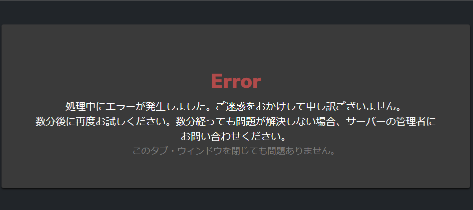

### パネルを設置する

`/verify`とタイプするのは面倒な場合があります。特に、モバイルユーザーにとってコマンド入力は億劫なものでしょう。  
パネルはこの問題を解決するための手段です。`/panel [channel]`を実行すると、指定したチャンネル（または実行したチャンネル）に認証パネルが設置されます。  

`/panel`を単独で使用した場合、`Success!`というレスポンス**とは別に**、実行したチャンネルに
パネルが送信されます。  
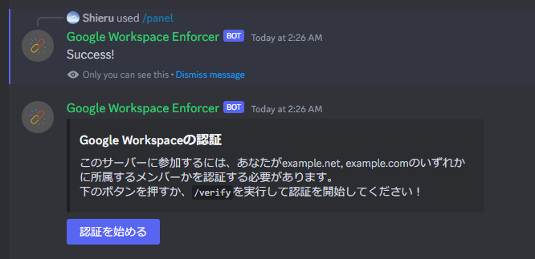

チャンネルを指定した場合、`Success!`というレスポンスとともに、指定したチャンネルにパネルが送信されます。  
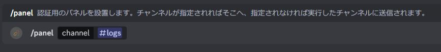
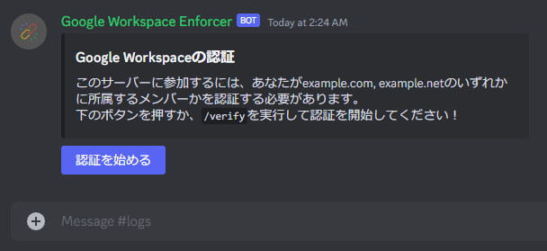

「認証を始める」ボタンをクリックすると、`/verify`コマンドの実行時と同様にEphemeralなメッセージで認証URLが送信されます。  
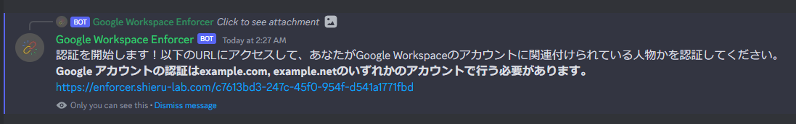

---

以上でセットアップは終了です。お疲れ様でした！

## コマンドリファレンス

以下は、このBotが提供するコマンドの一覧です。  
**権限** > **ユーザーに要求** の項目は、Bot側で設定している**デフォルトのメンバー権限**です。  
サーバーによるオーバーライドがない場合、Discordはこれを尊重し、実行可能なユーザーを自動的に決定します。  
「特定のチャンネルでは使わせたくない」場合や「権限に関わらずこのロールだけに使わせたい」などといった場合は、サーバー設定 > 連携サービスからこれをオーバーライドできます。

### /channel

#### 概要

認証が完了した際に、ログを送信するチャンネルを決定します。  
このコマンドは公開Botで利用可能です。そうでない場合、この設定は環境変数から読み込まれます。

#### 引数

* `channel: テキストチャンネル` ログを送信するチャンネル。

#### 権限

ユーザーに要求:

* チャンネルの管理 (Manage Channels)

### /domains

#### 概要

認証可能なドメインを管理します。  
これはコマンドグループであり、実行にはサブコマンドが必要です。  
このコマンドは公開Botで利用可能です。そうでない場合、この設定は環境変数から読み込まれます。

#### 引数

* `command: サブコマンド` 実行するサブコマンドを決定します。

#### 権限

ユーザーに要求:

* サーバーの管理 (Manage Server)

### /domains add

#### 概要

認証可能なドメインを追加します。  
これは`/domains`のサブコマンドです。

#### 引数

* `domain: テキスト` 追加するドメインを指定します。

#### 権限

Discord側の制限により、`/domains`の権限設定を継承します。

#### 成功

ドメインが正常に追加できた場合、このコマンドは成功します。

#### 失敗

以下の場合、このコマンドは失敗します:

* ドメインが既に追加されている場合
* ドメイン数制限によってこれ以上ドメインが追加できない場合

### /domains remove

#### 概要

認証可能なドメインを削除します。  
これは`/domains`のサブコマンドです。

#### 引数

* `domain: テキスト` 削除するドメインを指定します。

#### 権限

Discord側の制限により、`/domains`の権限設定を継承します。

#### 成功

ドメインが正常に削除できた場合、このコマンドは成功します。

#### 失敗

以下の場合、このコマンドは失敗します:

* ドメインが追加されていない場合

### /domains clear

#### 概要

認証可能なドメインをすべて削除します。  
これは`/domains`のサブコマンドです。

#### 権限

Discord側の制限により、`/domains`の権限設定を継承します。

#### 成功

ドメインが正常に削除できた場合、このコマンドは成功します。

### /domains list

#### 概要

認証可能なドメインの一覧を表示します。  
これは`/domains`のサブコマンドです。

#### 権限

Discord側の制限により、`/domains`の権限設定を継承します。

### /help

#### 概要

この公開Botに割り当てられているサポートサーバーをEphemeralメッセージで表示します。  
サポートサーバーへのリンクは環境変数から読み込まれます。このコマンドは公開Botで利用可能です。

### /panel

#### 概要

認証パネルを送信します。メンバーは、認証パネルに割り当てられているボタンをクリックして認証を開始できます。

#### 引数

* `channel: チャンネル` 任意。送信先のチャンネルを指定します。指定されなかった場合、実行したチャンネルが割り当てられます。

#### 権限

ユーザーに要求:

* メッセージの管理 (Manage Messages)

Botが要求:

* メッセージの送信 (Send Messages)
* 埋め込みリンク (Embed Links)

#### 成功

パネルを正常に送信できた場合、このコマンドは成功します。

#### 失敗

以下の場合、このコマンドは失敗します:

* パネルを送信できなかった場合
  * Botに適切な権限が与えられていない場合

### /role

#### 概要

メンバーが認証を完了した際に自動的に付与するロールを設定します。

#### 引数

* `role: ロール` 付与するロールを指定します。

#### 権限

ユーザーに要求:

* ロールの管理 (Manage Roles)

Botが要求:

* ロールの管理 (Manage Roles)

#### 成功

ロールが付与可能な場合、このコマンドは成功します。

#### 失敗

以下の場合、このコマンドは失敗します:

* ロールが付与できない場合
  * 指定されたロールの位置が、このBotが持つ最上位のロールと同じか上位に位置する場合
  * 指定されたロールの位置が、実行者の持つ最上位のロールt同じか上位に位置する場合
  * Botに権限が与えられていない場合

### /settings

#### 概要

設定が適切に構成されているか、簡易チェックを行います。

#### 権限

ユーザーに要求:

* サーバーの管理 (Manage Server)

### /verify

#### 概要

認証を開始します。認証URLを発行し、Ephemeralで実行者に伝えます。

#### 成功

認証URLが正常に発行できた場合、このコマンドは成功します。

#### 失敗

以下の場合、このコマンドは失敗します:

* 設定が正しく構成されていない場合（`/settings`を参照）
